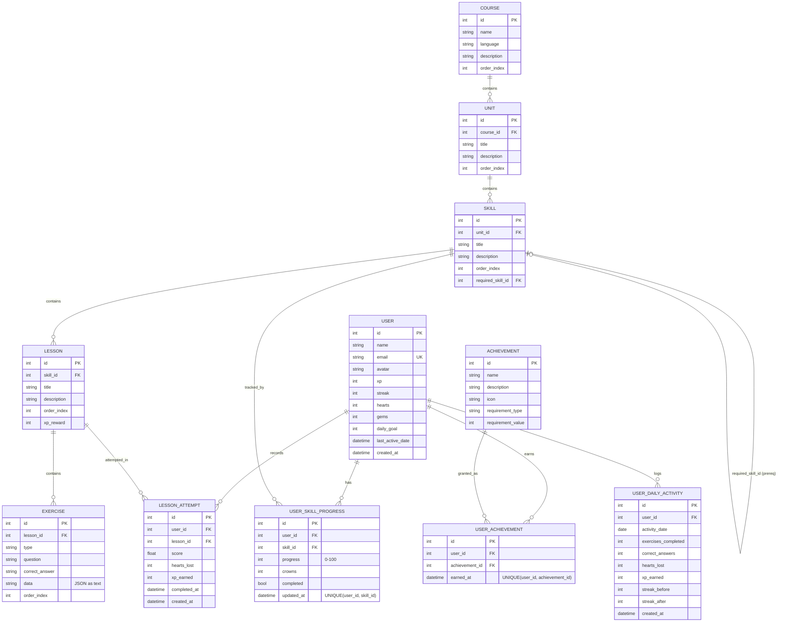
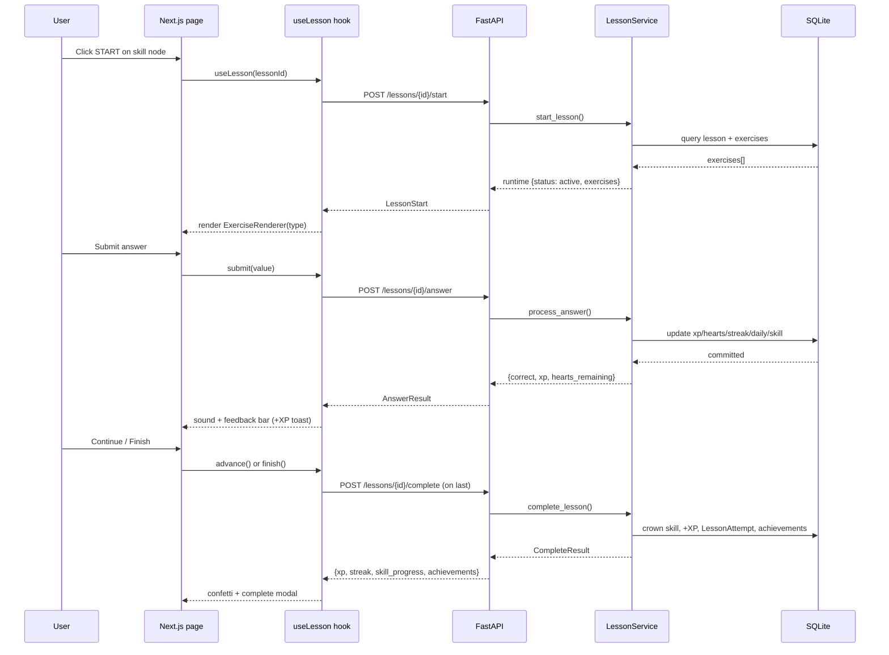
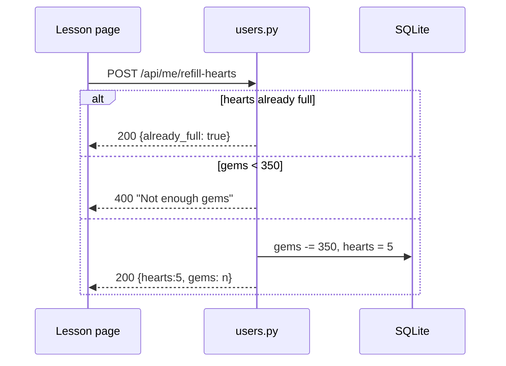
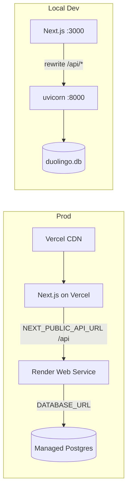

# ARCHITECTURE.md

## 1. Overview

The Duolingo Clone is a full-stack language-learning web application that replicates the core Duolingo experience: a winding learning path, interactive lessons with five exercise types, and a gamification layer (XP, streaks, hearts, gems, achievements, leaderboard).

The system is a **three-tier architecture** with a clear separation of concerns:

- **Presentation tier** – Next.js 16 frontend (TypeScript + Tailwind CSS)
- **Application tier** – FastAPI backend (Python 3.10, SQLAlchemy 2.x)
- **Data tier** – SQLite relational database

```text
┌────────────────────────────┐
│   Browser (User)           │
└────────────┬───────────────┘
             │ HTTP (Next.js App Router)
┌────────────▼───────────────┐
│  Next.js 16 Frontend       │  Presentation tier
│  (Server + Client React)   │
└────────────┬───────────────┘
             │ fetch() → /api/* (rewritten by next.config.ts)
┌────────────▼───────────────┐
│  FastAPI Backend           │  Application tier
│  Routers → Services → ORM  │
└────────────┬───────────────┘
             │ SQLAlchemy ORM
┌────────────▼───────────────┐
│  SQLite (duolingo.db)      │  Data tier
└────────────────────────────┘
```

## 2. Technology Stack

| Layer | Technology | Purpose |
|---|---|---|
| Frontend | Next.js 16 (App Router) | SSR + client components, file-based routing |
| Frontend | TypeScript | End-to-end type safety |
| Frontend | Tailwind CSS | Utility-first styling with a custom Duolingo color palette |
| Frontend | Web Audio API | Procedural correct/wrong sound effects (no assets) |
| Frontend | Web Speech API | Text-to-speech button in the type-answer exercise |
| Backend | FastAPI | REST API, automatic OpenAPI docs |
| Backend | Python 3.10 | Runtime |
| Backend | SQLAlchemy 2.x ORM | Typed models, relationships, migrations-free schema |
| Backend | Pydantic v2 (pydantic-settings) | Response schemas + configuration |
| Database | SQLite | Zero-config file-based storage |

## 3. Frontend Architecture

### 3.1 Routing Model (App Router)

```text
frontend/app/
├── layout.tsx                 # Root layout (fonts, globals)
├── globals.css                # Tailwind + custom Duolingo theme tokens
├── (main)/
│   ├── layout.tsx             # Sidebar + TopBar + MobileNav shell
│   ├── page.tsx               # "/" → redirects to /learn
│   ├── learn/page.tsx         # Learning-path road (PathUnit / Road / PathNode)
│   ├── profile/page.tsx       # Learner stats + achievements
│   ├── leaderboard/page.tsx   # Weekly challenge leaderboard
│   └── settings/page.tsx      # Settings placeholders (toggles)
└── lesson/
    └── [lessonId]/page.tsx    # Lesson player (no sidebar shell)
```

Two layout groups:
- `(main)/` – pages wrapped in the app shell (Sidebar, TopBar, MobileNav).
- `lesson/[lessonId]/` – a full-screen, distraction-free lesson player with its own header (exit link, progress bar, hearts, XP).

### 3.2 Component Tree

```text
Layouts
├── (main)/layout.tsx
│   ├── Sidebar            (desktop)  components/layout/sidebar.tsx
│   ├── TopBar                        components/layout/topbar.tsx
│   └── MobileNav          (mobile)   components/layout/sidebar.tsx

Pages
├── learn/page.tsx → PathUnit → Road (SVG) + PathNode
├── profile/page.tsx → StatCard grid + achievement tiles
├── leaderboard/page.tsx → medal rows + division card
└── lesson/[lessonId]/page.tsx
    ├── LessonBody → ExerciseCard
    │   └── ExerciseRenderer ──> MultipleChoice / WordBank / MatchPairs /
    │                            FillBlank / TypeAnswer   (components/lesson/)
    ├── Modal (complete / out-of-hearts)  components/ui/Modal.tsx
    ├── Confetti (on complete)            components/ui/Confetti.tsx
    └── Toast (+XP feedback)              components/ui/Toast.tsx

Shared
├── components/icon.tsx      SVG icon set (DuoOwl, hearts, crowns, etc.)
└── components/layout/*      TopBar (streak/XP/hearts/gems), Sidebar nav
```

### 3.3 State Management

State is managed with **React hooks + local component state** — there is no global store (no Redux/Zustand).

| Hook | File | Responsibility |
|---|---|---|
| `useUserProgress` | `hooks/useUserProgress.ts` | Fetches `GET /api/user` + `GET /api/path` in parallel; exposes `user`, `path`, `loading`, `refresh()` |
| `useLesson` | `hooks/useLesson.ts` | Full lesson runtime: start, current exercise, submit, advance, complete, retry, heart refill |

### 3.4 Lesson Runtime State Machine

`useLesson` keeps a single `runtime` object whose `status` drives the UI:

```text
idle ──▶ active ──▶ completed
              │
              └──▶ out_of_hearts
```

| Status | Meaning | Trigger |
|---|---|---|
| `idle` | No lesson loaded yet | initial |
| `active` | Answering exercises | `POST …/start` resolves |
| `completed` | All exercises answered (or last advance) | last `advance()` or `complete()` |
| `out_of_hearts` | Hearts reached 0 | answer returns `hearts_remaining <= 0` |

Supporting state on `runtime`:
- `index` – current exercise pointer; `submitted` – answer in-flight / awaiting advance
- `lastResult` – latest grading response (drives feedback bar + sounds)
- `completeResult` – payload from `POST …/complete`
- `summary` – `{ correct, total, heartsLost, perfect }` for the completion modal
- `attempt` – bump to restart a lesson (retry after error / after refill)

### 3.5 Exercise Rendering System

A discriminated-union design. Every exercise row has a `type`; `ExerciseRenderer` switches on it and delegates to a dedicated component. All renderers share a common contract (`components/lesson/types.ts`): they collect the answer into the shared `value: string` via `onChange`.

```text
ExerciseRenderer ──▶ MultipleChoice   data.options[]
                  ──▶ WordBank        data.words[] (tap words to build sentence)
                  ──▶ MatchPairs      data.pairs[]
                  ──▶ FillBlank       question "______" + optional data.words[]
                  ──▶ TypeAnswer      free text + TTS speaker button
```

The `lesson/[lessonId]/page.tsx` holds the answer string and passes it down, so grading is uniform: every renderer ultimately produces one `value` string sent to `POST …/answer`.

### 3.6 API Client (`lib/api.ts`)

- Thin `fetch` wrapper (`request<T>`) with JSON serialization, `credentials: include`, and error propagation (`throw new Error("<status>: <body>")`).
- `BASE_URL = process.env.NEXT_PUBLIC_API_URL || ""` — empty means same-origin, served by the `next.config.ts` rewrite to `http://127.0.0.1:8000/api/:path*`.
- Functions: `getMe`, `getPath`, `startLesson`, `answerExercise`, `completeLesson`, `getLeaderboard`, `refillHearts`.
- Response shapes mirror `lib/types.ts`, which mirrors backend Pydantic schemas.

### 3.7 Sound System (`lib/sounds.ts`)

Procedural Web Audio API (no audio files):
- `playCorrectSound()` – ascending E5→B5→E6 triangle/sine "ding-ding".
- `playWrongSound()` – descending G3→E3→B2 sawtooth "wah-wah".
- `initAudio()` / `unlockAudio()` – attach one-shot gesture listeners (`pointerdown`/`keydown`/`touchstart`) and create/resume the `AudioContext` on the first interaction to satisfy the browser autoplay policy.
- Wired in the lesson page: on `runtime.lastResult`, toast `+XP` + correct sound, or wrong sound.

## 4. Backend Architecture

### 4.1 Package Structure

```text
backend/app/
├── main.py                  # FastAPI app, CORS, routers, startup seed
├── config.py                # pydantic-settings; all tunable constants
├── db/
│   ├── __init__.py          # engine, SessionLocal, get_db (commit/rollback), create_tables
│   └── seed.py              # seed_database() + content seeders
├── models/
│   ├── base.py              # SQLAlchemy declarative Base
│   ├── course.py            # Course, Unit, Skill, Lesson, Exercise
│   └── user.py              # User, UserSkillProgress, Achievement,
│                            #   UserAchievement, LessonAttempt, UserDailyActivity
├── schemas/
│   ├── course.py            # content response models
│   ├── user.py              # UserSummary, UserDetail
│   └── progress.py          # path + lesson attempt models
├── api/
│   ├── path.py              # GET /api/path
│   ├── users.py             # GET /api/user, POST /api/me/reset-streak, /refill-hearts
│   ├── lessons.py           # POST /api/lessons/{id}/start | /answer | /complete
│   └── leaderboard.py       # GET /api/leaderboard
└── services/
    ├── lesson_service.py    # lesson state machine + XP + daily activity + skill progress
    ├── streak_service.py    # deterministic streak math
    ├── heart_service.py     # lazy heart regen + deduction
    └── achievement_service.py # requirement evaluation + awarding
```

### 4.2 Request Lifecycle

```text
HTTP request
   │
   ▼
FastAPI router (thin, HTTP concerns only)
   │
   ▼
Service layer (pure business logic, receives db + user)
   │
   ▼
SQLAlchemy ORM (models)
   │
   ▼
SQLite
   │
   ▼
get_db(): db.commit() on success / db.rollback() on exception / db.close()
   │
   ▼
Pydantic response model → JSON
```

**Transaction management** (`app/db/__init__.py::get_db`) is the persistence backbone: a FastAPI dependency that commits the transaction automatically when the request handler returns, and rolls back on any exception. Every progress mutation (XP, hearts, streak, skill progress, attempts, daily activity) is therefore atomic per request.

### 4.3 API Surface

| Method | Path | Purpose |
|---|---|---|
| GET | `/api/user` | Current user profile (streak/hearts recalculated live, `xp_today`, `earned_achievement_ids`) |
| POST | `/api/me/reset-streak` | Testing helper |
| POST | `/api/me/refill-hearts` | Refill to max hearts for 350 gems |
| GET | `/api/path` | Units + skills with status/progress/crowns/first lesson |
| POST | `/api/lessons/{id}/start` | Lesson metadata + full exercise list + runtime snapshot |
| POST | `/api/lessons/{id}/answer` | Grade one answer, update XP/hearts/streak/daily/skill progress |
| POST | `/api/lessons/{id}/complete` | Crown the skill, award completion XP, evaluate achievements |
| GET | `/api/leaderboard` | Users ranked by XP |

Authentication is simplified: there is no JWT/session. The backend treats the **first `User` row (seeded "Utkarsh")** as the signed-in learner.

### 4.4 Service Layer Details

**LessonService** (`services/lesson_service.py`)
- `start_lesson` – validates the lesson exists, loads ordered exercises, returns a fresh runtime (`current_exercise_index=0`, `status="active"`).
- `process_answer` – grades against `correct_answer` (case-insensitive trim); match-pairs/word-bank with no stored answer are graded visually on the client (any non-empty answer = success). On wrong answer deducts a heart. Then updates in one flush:
  - `User.xp` (+5 correct), `User.hearts`, `User.streak`, `User.last_active_date`
  - `UserDailyActivity` (created or upserted for today; increments exercises/correct/hearts_lost/xp)
  - `UserSkillProgress` (+20 correct / −10 wrong, capped 0–100)
- `complete_lesson` – sets skill progress to 100, +1 crown, `completed=True`; +10 XP; unlocks the next skill via `required_skill_id`; records a `LessonAttempt`; evaluates achievements with `perfect_lesson=True`.

**StreakService** (`services/streak_service.py`) – pure, deterministic, testable:
- `calculate_streak` (display): same day → `max(stored, 1)`; yesterday → preserve; older → 0.
- `compute_new_streak` (persist): first ever → 1; next day → +1; same day → unchanged (≥1); missed → 1.

**HeartService** (`services/heart_service.py`) – lazy regeneration: `elapsed // 30 min` hearts added, capped at max; **no background jobs** — regeneration is computed on each state request from `last_active_date`.

**AchievementService** (`services/achievement_service.py`) – evaluates every `Achievement` row against current stats by `requirement_type` (`lessons_completed` | `streak` | `total_xp` | `perfect_lesson`) and inserts `UserAchievement` rows (deduped by unique constraint).

## 5. Data Model

### 5.1 Entity Relationship Diagram



### 5.2 Key Design Notes

- **Content hierarchy**: `Course → Unit → Skill → Lesson → Exercise` with cascade deletes. `Skill.required_skill_id` is a self-FK defining unlock order (Family unlocks after Greetings).
- **User progress is content-agnostic**: `UserSkillProgress` (per-skill), `LessonAttempt` (per-attempt history), `UserDailyActivity` (per calendar date — powers `xp_today` and streak bookkeeping).
- **`UserDailyActivity.activity_date` is a `Date()` column** (not datetime) so it compares cleanly against `date.today()`.
- **`User.last_active_date` defaults to `NULL`** on seed so the first real activity starts the streak at 1 (avoids a same-day no-op).

## 6. Business Flows

### 6.1 Lesson Lifecycle



### 6.2 Heart Refill



### 6.3 Data Consistency Guarantees

1. **Single-writer ORM sessions** – one `get_db` dependency per request; commit-or-rollback keeps XP/hearts/streak/skill/daily mutations atomic.
2. **Backend-authoritative grading** – `correct_answer` is validated server-side; the client only packages the answer.
3. **Lazy derived state** – streak and hearts are recomputed from persisted timestamps on read (`GET /api/user`, `/api/leaderboard`), so displayed values are always current even across server restarts.
4. **Unique constraints** – `(user_id, skill_id)` for skill progress, `(user_id, achievement_id)` for achievements, prevent duplicate rows.

## 7. Deployment Architecture



- **Local dev**: `next.config.ts` rewrites `/api/*` → `http://127.0.0.1:8000/api/*`. Backend seeds on startup (`SEED_ON_STARTUP=True`). Delete `duolingo.db` (while stopped) to reset.
- **Production**: frontend → Vercel (Root Dir `frontend`, env `NEXT_PUBLIC_API_URL`); backend → Render (root `backend/`, start `uvicorn app.main:app --host 0.0.0.0 --port $PORT`). SQLite is ephemeral on free tiers — swap `DATABASE_URL` to managed Postgres for persistence, and add the Vercel origin to `CORS_ORIGINS`.
- **CORS**: `allow_origins` is the only cross-origin gateway; same-origin dev via the proxy needs none.

## 8. Security Considerations

- No secrets, tokens, or keys are stored or transmitted (single-user, local auth model).
- CORS restricted to the known frontend origins (localhost:3000 / deployed domain).
- No client-supplied IDs are trusted without a DB lookup; missing resources return 404.
- All user-mutating operations run through the transactional `get_db` (rollback on error prevents partial writes).
- Deployment notes: never commit the SQLite file; use managed DB + env config in production.

## 9. Testing Strategy

- **Backend (pytest, `backend/tests/`)**: 25 passing tests covering API flows, streak math, and heart regeneration — see `conftest.py` (in-memory SQLite + test client), `test_api.py`, `test_streak_service.py`, `test_heart_service.py`. Run: `backend\.venv\Scripts\python.exe -m pytest`.
- **Frontend**: `npm run lint` (ESLint) and `npm run build` (type-check + production build) gate CI-style correctness.
- **Manual smoke** verified all routes return 200 and lesson grading persists XP/hearts/streak/achievements end-to-end.

## 10. Performance & Scalability Considerations

- **SQLite** suits the single-user demo; `pool_pre_ping=True` guards stale connections.
- Lesson start returns the **full exercise list** (small seeded payload) — acceptable at this scale; a larger catalog would switch to per-exercise streaming or pagination.
- `UserDailyActivity` upsert is O(1) per activity; streak/hearts are O(1) math — no background schedulers.
- Eagerly joined relationships are avoided; per-request queries are simple and index-backed by FKs/unique constraints.

## 11. Design Decisions & Tradeoffs

| Decision | Rationale / Tradeoff |
|---|---|
| **Next.js App Router + client hooks** | Simple local state beats a global store at this scale; keeps lesson runtime colocated and testable |
| **FastAPI + SQLAlchemy 2 typed ORM** | Auto-docs, clean dependency injection, type-safe models, minimal boilerplate |
| **Backend-authoritative grading** | Prevents client-side answer tampering; single source of truth for XP/hearts |
| **Lazy heart regeneration** | No cron/background worker; derived on read — trivial to operate, deterministic |
| **Deterministic streak math** | Pure date arithmetic → unit-testable, no timezone ambiguity |
| **`UserDailyActivity` date-keyed rows** | Powers `xp_today` and streak transitions with a single upsert per activity |
| **`earned_achievement_ids` in the profile API** | Frontend unlocks achievement tiles only for genuinely earned rows (fixes positional-index bug) |
| **Procedural Web Audio sounds** | Zero asset pipeline; autoplay handled via gesture unlock |
| **SVG road for the learning path** | Pure CSS/SVG → crisp at any DPI, easy to color traveled vs locked segments |
| **SQLite local / Postgres cloud** | Zero-config demo; `DATABASE_URL` swap for durable production storage |
