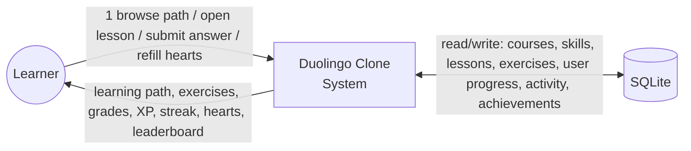
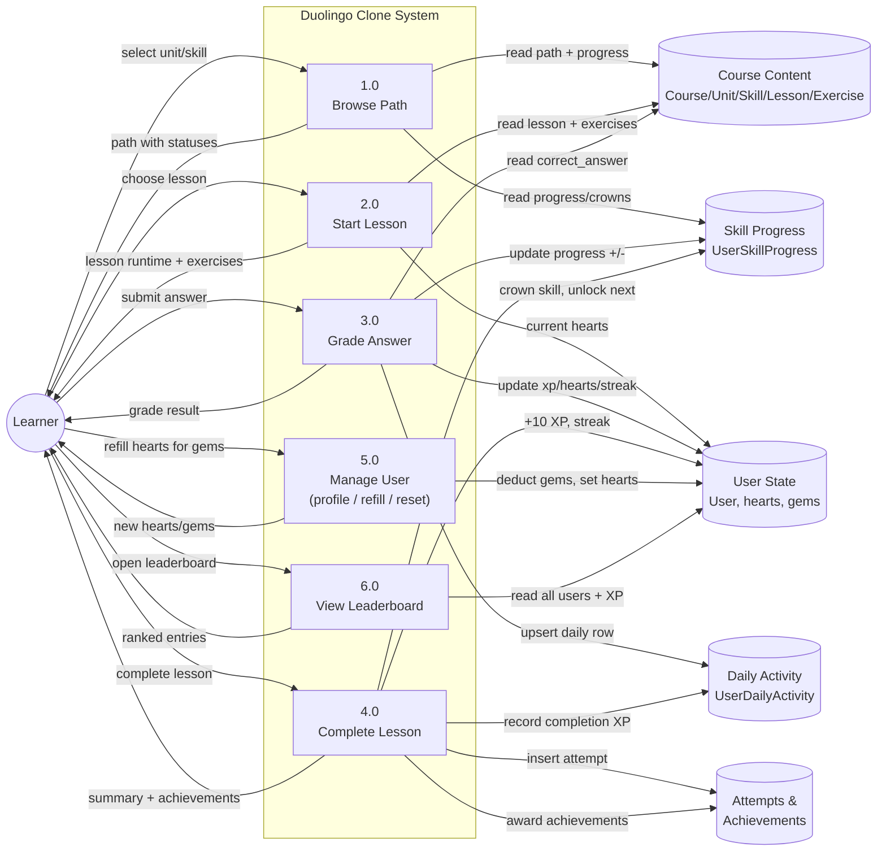
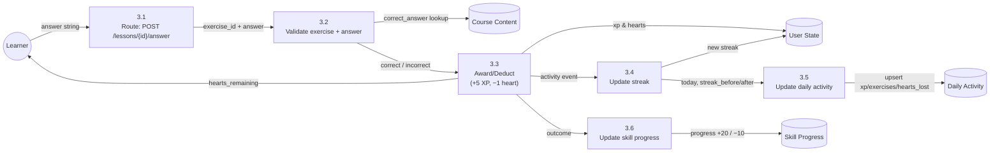

# Duolingo Clone

A functional clone of the Duolingo web application that replicates Duolingo's design, user experience, and core lesson and gamification workflows.

## Demo

[Live Demo Link](https://duolingo-clone-scaler-ai-labs.vercel.app/learn)

## Features

### Learning Path / Skill Tree

- Visual winding **road** connecting milestone skills (Duolingo-style), green for completed, grey for locked
- Completed vs available vs locked states with crown/check badges
- Current skill highlighted with a START / CONTINUE bubble
- Top bar showing streak, XP, hearts, and gems

### Lesson Player (Core Loop)

- Multiple exercise types: multiple choice, translate (word bank), match pairs, fill in the blank, and type-the-answer
- Immediate correct/incorrect feedback with signature feedback bar + shake animation on wrong answers
- Distinct **sound effects** for correct vs wrong answers (Web Audio API, no audio files)
- Progress bar across the lesson
- Hearts system: lose one on wrong answer; lesson end/failure handled
- XP award and skill progress tracking on completion

### Gamification & Progress

- Streak counter that increments on daily activity
- XP totals with consistent calculation
- Hearts regeneration over time (1 heart every 30 minutes)
- Daily goal / XP goal indicator
- All progress persists per user in database

### Content Management

- Course content (units, skills, lessons, exercises) stored in database and seeded
- Learner profile page with stats (streak, total XP, achievements)
- All learner progress persists per user

### Duolingo Experience

- Playful, colorful, gamified UI with mascot-style flourishes
- The lesson player with animated feedback
- Modals (lesson complete, out of hearts), toasts, and celebratory states
- Path navigation and progress visuals
- Settings placeholders

## Tech Stack

- **Frontend**: Next.js 16 with TypeScript, Tailwind CSS
- **Backend**: FastAPI with Python 3.10
- **Database**: SQLite with SQLAlchemy 2.x ORM
- **UI Components**: custom Tailwind components (no external UI kit)

## Architecture

```text
Frontend (Next.js)
    │
    ▼
API Client (fetch to FastAPI)
    │
    ▼
Backend (FastAPI)
    │
    ▼
Database (SQLite)
```

### Data Flow Diagrams (DFD)

#### DFD Level 0 — Context Diagram

The whole system is one process; the learner is the only external entity. All state is persisted in the SQLite data store, and the FastAPI layer is the single path between the UI and the data.



#### DFD Level 1 — Major Processes & Data Stores



#### DFD Level 2 — Lesson Answer Flow (Process 3.0 expanded)



**How to read these DFDs**: rectangles are processes, rounded shapes are external entities (the learner), cylinders are persistent data stores, and arrows are data flows. Each process corresponds to a backend router/service — e.g. process 3.x maps to `POST /api/lessons/{id}/answer` → `LessonService.process_answer`, which is why XP, hearts, streak, daily activity, and skill progress all update in one transaction.

### Database Schema

#### Course Model

```text
Course
  id: INTEGER (PK)
  name: TEXT
  language: TEXT (default: "Spanish")
  description: TEXT (nullable)
  order_index: INTEGER (default: 0)
```

#### Unit Model

```text
Unit
  id: INTEGER (PK)
  course_id: INTEGER (FK -> Course.id, ondelete="CASCADE")
  title: TEXT
  description: TEXT (nullable)
  order_index: INTEGER (default: 0)
```

#### Skill Model

```text
Skill
  id: INTEGER (PK)
  unit_id: INTEGER (FK -> Unit.id, ondelete="CASCADE")
  title: TEXT
  description: TEXT (nullable)
  order_index: INTEGER (default: 0)
  required_skill_id: INTEGER (FK -> Skill.id, nullable=True)
```

#### Lesson Model

```text
Lesson
  id: INTEGER (PK)
  skill_id: INTEGER (FK -> Skill.id, ondelete="CASCADE")
  title: TEXT
  description: TEXT (nullable)
  order_index: INTEGER (default: 0)
  xp_reward: INTEGER (default: 10)
```

#### Exercise Model

```text
Exercise
  id: INTEGER (PK)
  lesson_id: INTEGER (FK -> Lesson.id, ondelete="CASCADE")
  type: TEXT ("multiple_choice" | "word_bank" | "match_pairs" | "fill_blank" | "type_answer")
  question: TEXT (not null)
  correct_answer: TEXT (not null)
  data: TEXT (nullable, JSON)
  order_index: INTEGER (default: 0)
```

#### User Model

```text
User
  id: INTEGER (PK)
  name: TEXT (not null)
  email: TEXT (unique, not null)
  avatar: TEXT (nullable)
  xp: INTEGER (default: 0)
  streak: INTEGER (default: 0)
  hearts: INTEGER (default: 5)
  gems: INTEGER (default: 120)
  daily_goal: INTEGER (default: 20)
  last_active_date: DATETIME (timezone-aware)
  created_at: DATETIME (timezone-aware, default: func.now())
```

#### UserSkillProgress Model

```text
UserSkillProgress
  id: INTEGER (PK)
  user_id: INTEGER (FK -> User.id, ondelete="CASCADE")
  skill_id: INTEGER (FK -> Skill.id, ondelete="CASCADE")
  progress: INTEGER (0-100, default: 0)
  crowns: INTEGER (default: 0)
  completed: BOOLEAN (default: False)
  updated_at: DATETIME (timezone-aware, default: func.now(), onupdate: func.now())
```

#### UserAchievement Model

```text
UserAchievement
  id: INTEGER (PK)
  user_id: INTEGER (FK -> User.id, ondelete="CASCADE")
  achievement_id: INTEGER (FK -> Achievement.id, ondelete="CASCADE")
  earned_at: DATETIME (timezone-aware, default: func.now())
```

#### UserDailyActivity Model

```text
UserDailyActivity
  id: INTEGER (PK)
  user_id: INTEGER (FK -> User.id, ondelete="CASCADE")
  activity_date: DATE (not null)
  exercises_completed: INTEGER (default: 0)
  correct_answers: INTEGER (default: 0)
  hearts_lost: INTEGER (default: 0)
  xp_earned: INTEGER (default: 0)
  streak_before: INTEGER (default: 0)
  streak_after: INTEGER (default: 0)
  created_at: DATETIME (default: func.now())
```

### API Overview

#### User Endpoints

- `GET /api/user` - Get the current (default) user profile including `xp_today` and `earned_achievement_ids`
- `POST /api/me/reset-streak` - Reset user streak (testing)
- `POST /api/me/refill-hearts` - Refill hearts to max for `REFILL_GEM_COST` gems

#### Path Endpoints

- `GET /api/path` - Get the learning path with units and skills (empty units/skills are skipped)

#### Lesson Endpoints

- `POST /api/lessons/{lessonId}/start` - Start a lesson (returns exercises + runtime state)
- `POST /api/lessons/{lessonId}/answer` - Process answer to exercise
  - Request: `{"exercise_id": int, "answer": string}`
- `POST /api/lessons/{lessonId}/complete` - Complete a lesson (XP, crowns, unlock next, achievements)

#### Leaderboard

- `GET /api/leaderboard` - Get leaderboard entries (rank, name, xp, streak)

### Seed Data

The application comes pre-seeded with:

- **1 course**: Spanish
- **3 units**: Basics (empty, hidden from the path), Greetings, Food
- **5 skills**: Greetings (3 lessons) and Family (1 lesson, unlocks after Greetings) in unit "Greetings"; Food (2 lessons) in unit "Food"; Numbers and Common Phrases (locked, no lessons yet)
- **6 lessons** across 3 skills
- **16 exercises** covering all 5 exercise types: 6 multiple choice, 3 word bank, 3 fill blank, 3 type answer, 1 match pairs
- **4 achievements**: First Lesson, 7 Day Streak, XP Hunter, Perfect Lesson
- **1 default user**: "Utkarsh" with 0 XP, 0 streak, 5 hearts, 1000 gems (enough for a few heart refills), `daily_goal` 20
- **7 leaderboard rivals**: Emma, Liam, Olivia, Noah, Ava, Mia, Lucas

### Tests

Backend has 25 passing pytest tests under `backend/tests/` (API flows, streak calculation, heart regeneration). Run them with:

```bash
cd backend
.\.venv\Scripts\python.exe -m pytest
```

### Design Decisions

1. **Heart Regeneration**: Lazy regeneration calculated on state request, not background job. 1 heart every 30 minutes, max 5 hearts.

2. **Streak Logic**: Deterministic streak calculation based on last_active_date:
   - First activity: streak = 1
   - Activity on next calendar day: streak += 1
   - Activity on same calendar day: streak unchanged
   - Missed day: streak = 1

3. **XP System**:
   - Correct answer: +5 XP
   - Lesson completion: +10 XP
   - Perfect lesson bonus: +5 XP (when no hearts lost)

4. **Answer Validation**: Backend-authoritative - the frontend sends the answer, the backend validates it against the correct_answer stored in the database.

5. **Hearts System**:
   - Max hearts: 5
   - Wrong answer: -1 heart
   - If hearts reach 0: show "Out of Hearts" modal
   - Regeneration: 1 heart every 30 minutes, calculated lazily
   - Refill: spend `REFILL_GEM_COST` (350) gems to restore all 5 hearts instantly

### Local Setup

```bash
# Backend
cd backend
python -m venv .venv
.\.venv\Scripts\activate
pip install -r requirements.txt
python -m uvicorn app.main:app --host 127.0.0.1 --port 8000 --reload

# Frontend (in a second terminal)
cd frontend
npm install
npm run dev
```

The frontend proxies `/api/*` to the backend via `next.config.ts` rewrites, so no extra config is needed. The database is seeded automatically on startup (`SEED_ON_STARTUP=True`). To start from a clean slate, delete `backend/duolingo.db` while the backend is stopped and restart it.

### Environment Variables

No environment variables are required for basic operation.

- `NEXT_PUBLIC_API_URL` (frontend, optional): absolute backend URL when the proxy is not used
- `DATABASE_URL` (backend, optional): SQLAlchemy URL, defaults to `sqlite:///backend/duolingo.db`

### Deployment

**Backend → Render**

1. Push the repo to GitHub.
2. In Render, create a **New Web Service** and point it at the repo's `backend/` root.
3. Build command: `pip install -r requirements.txt`
4. Start command: `uvicorn app.main:app --host 0.0.0.0 --port $PORT`
5. SQLite file storage is ephemeral on Render's free tier — for persistent progress use a managed Postgres and set `DATABASE_URL`, or re-seed on each deployment with `SEED_ON_STARTUP=True` (default).

**Frontend → Vercel**

1. In Vercel, import the repo and set **Root Directory** to `frontend`.
2. Framework preset: **Next.js** (auto-detected).
3. Set build command `npm run build` (dev) and output `default` (Vercel handles it).
4. Set the environment variable `NEXT_PUBLIC_API_URL` to your Render backend URL, e.g. `https://your-app.onrender.com`.
5. Deploy. Because production requests cross origin, ensure Render's CORS `CORS_ORIGINS` in `backend/app/config.py` includes your Vercel domain.

### Assumptions

- Real user authentication is simplified (assume a default logged-in learner)
- Real speech recognition/pronunciation exercises are placeholders
- In-app purchases/Super subscription are mocked
- Multiple languages are not supported (one seeded language is enough)
- Friends/social features are placeholders (seeded leaderboard only)

### Code Quality

- Clean, readable, and well-organized code
- Proper separation of concerns between frontend and backend
- Reusable exercise engine with type-based rendering
- Deterministic business logic (streak, hearts, XP)
- Database schema with proper relationships

### Project Structure

```text
backend/
  app/
    main.py          # FastAPI app with startup seeding
    db/              # Database session + get_db (commit/rollback) + seeding
    config.py        # Application configuration (gems, XP, hearts, CORS)
    models/          # SQLAlchemy models (base.py, course.py, user.py)
    api/             # API routes (path.py, users.py, lessons.py, leaderboard.py)
    schemas/         # Pydantic response models (course.py, user.py, progress.py)
    services/        # Business logic (heart_service.py, lesson_service.py, streak_service.py, achievement_service.py)
  tests/             # Pytest suite (conftest.py, test_api.py, test_streak_service.py, test_heart_service.py)
  requirements.txt
  pytest.ini

frontend/
  app/               # Next.js app router
    (main)/          # Sidebar layout group: learn/, profile/, leaderboard/, settings/, page.tsx
    lesson/
      [lessonId]/
        page.tsx     # Lesson player (uses ExerciseRenderer)
    layout.tsx
    globals.css
  components/
    icon.tsx         # SVG icon set
    layout/          # Sidebar, TopBar
    lesson/          # ExerciseRenderer + per-type renderers (MultipleChoice, WordBank, MatchPairs, FillBlank, TypeAnswer, types.ts)
    ui/              # Reusable UI (Modal, Toast, Confetti)
  hooks/
    useUserProgress.ts    # User progress hook
    useLesson.ts          # Lesson state machine hook (start/answer/advance/finish/retry/refill)
  lib/
    api.ts           # API client (proxied through /api/*)
    types.ts         # Type definitions + XP_VALUES
    sounds.ts        # Procedural Web Audio correct/wrong sound effects
  next.config.ts     # /api/* rewrite to backend
  package.json
```

## Evaluation Criteria

### Functionality

- All core features working correctly, including the lesson loop and gamification (XP, streak, hearts)
- Lesson navigation from home path to skill to lesson to exercises
- Progress persistence per user

### UI/UX

- Visual similarity to the original Duolingo app's design
- Playful, colorful, gamified interface
- The lesson player with animated feedback
- Modals, toasts, and celebratory states
- Path navigation and progress visuals

### Database Design

- Well-structured schema with proper relationships
- Course -> Unit -> Skill -> Lesson -> Exercise hierarchy
- User-specific progress tracking (UserSkillProgress)
- Achievement system

### Backend / API Design

- Clean, sensible API design
- Authoritative answer validation (backend validates, not frontend)
- Resource-oriented endpoints

### Code Quality

- Clean, readable, and well-organized code
- Proper separation of concerns
- Code modularity (reusable ExerciseRenderer component)
- Code understanding (able to explain implementation decisions)

### Code Modularity

- Proper separation of concerns
- Reusable ExerciseRenderer component that switches between 5 exercise types
- Separate services for lesson, progress, streak, and heart management
- Type-safe API client with TypeScript

### Code Understanding

- Able to explain:
  - The lesson state machine (IDLE -> LOADING -> ACTIVE -> FEEDBACK -> CORRECT/WRONG -> NEXT/COMPLETE)
  - The heart regeneration logic (lazy, 30-minute intervals)
  - The streak calculation (deterministic based on dates)
  - The exercise validation flow (frontend sends answer, backend validates)
  - The database schema relationships
